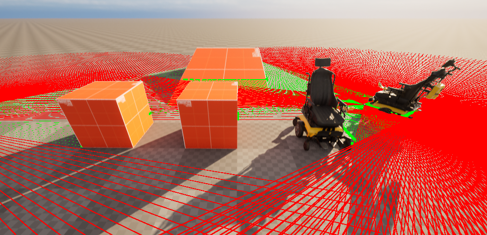

## About `nemo-simulation-unreal`

This repository contains the Nemo Simulator (Unreal Engine) project for simulating a self-driving wheelchair in a virtual environment. The simulation allows for testing and development of the wheelchair's autonomous navigation system by providing a realistic 3D environment and streaming sensor data over a TCP connection.

### Features

* Simulated environment
* Wheelchair control
  - `W`, `S`: Move the wheelchair forward or backward
  - `A`, `D`: Rotate the wheelchair
  - `R`: Reset the wheelchair's rotation to its initial rotation
  - `P`: Toggle the free camera mode, which allows you to navigate  the enivorment independently of the wheelchair
* Sensor streaming
* Extendible architecture

### Getting started

1. Clone the repository: `git clone https://github.com/farfler/nemo-simulation-unreal`
2. Open the project in Unreal Engine 5.3
3. Build and run the project
